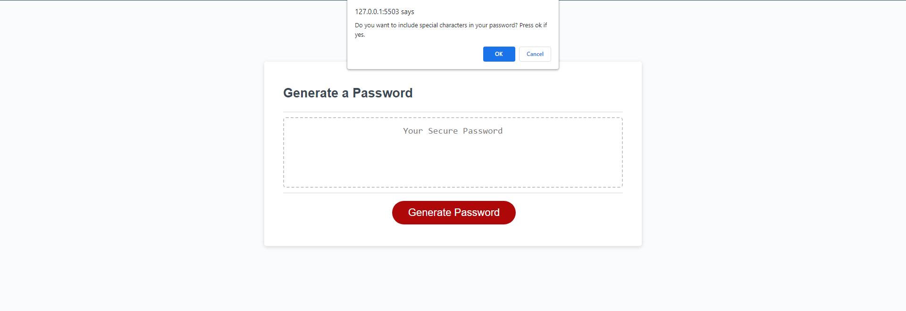

# Password-Generator

## Week 2 Module 3 Challenge - UCI Bootcamp

This was our third challenge project of our bootcamp. Overall, we were given some basic HTML, CSS, and JavaScript code to work with. We were told to create a password generator that allows users to specify what they wanted in their generated password. I first created arrays that included all of the possible characters that could be included in the password and then began writing the JavaScript logic and functions. Overall it was similar to the game logic we used to write our Rock, Paper, Scissors game so it was not overly difficult, but I ran into some problems with concating arrays. I figured out that I needed to set the array to become the new array, and that fixed most of my issues. I then ran into an issue where I added in a "Special Character", "Number", "Lower Case Letter", and/or "Upper Case Letter" depending on the user's inputs to ensure that at least one character of their selection was inputted. However, this made it so that these characters appeared at the beginning of the password, so the order was not random. I tried fixing this myself, but I was not able to create the loop for it, so I did some research and ended up using javascript.info/task/shuffle in order to create a shuffle array function.   

## Table of Contents

- [Installation](#installation)
- [Usage](#usage)
- [Credits](#credits)
- [License](#license)

## Installation

N/A

## Usage

The website is live [Password-Generator][https://wangbrian26.github.io/Password-Generator/]

This is a password generator that allows users to choose what they want to have in their randomly generated password. 

When you go onto the page, you will be greated with a box. If you click on the red "Generate Password" button, you will be prompted to enter your specific criteria for your password. 

- How many characters would you like in your password? Please choose a number between 8 and 128. 
  - This asks the user how long they would like their new password to be. The password must be between 8 and 128 characters long. If users input a number lower than 8 or higher than 128, they will get an error message and be reprompted to give a valid answer. 
- Do you want to include special characters in your password? Press ok if yes.
  - This asks the user if they want to include special characters in their password. If yes, user will press the blue "Ok" button. If no, user will press the white "Cancel" button.
- Do you want to include numbers in your password? Press ok if yes.
  - This asks the user if they want to include numbers in their password. If yes, user will press the blue "Ok" button. If no, user will press the white "Cancel" button.
- Do you want to include lower case letters in your password? Press ok if yes.
  - This asks the user if they want to include lower case letters in their password. If yes, user will press the blue "Ok" button. If no, user will press the white "Cancel" button.
- Do you want to include upper case letters in your password? Press ok if yes.
  - This asks the user if they want to include upper case letters in their password. If yes, user will press the blue "Ok" button. If no, user will press the white "Cancel" button.

## Credits

Thanks to Instructor Quinton Fults, TA Takara Truong, and TA Black Marcus for helping with the learning on these elements. Thanks to ![javascript info][http://javascript.info/task/shuffle] for the function to shuffle an array.

## License

N/A